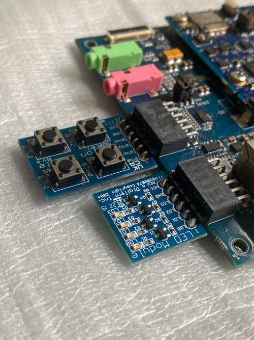
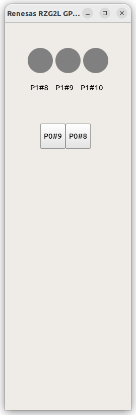

# q563_rzgpio

Purpose : A Qt Quick Project demo how to connect to PMOD buttons and leds for Renesas RZ/G2L.

## 1. Prerequisites

Prepare a Renesas RZ/G2L board running a pre-build BSP image or yocto build image by using 'core-image-qt' . We will transfer and execute our code on it later.

Also install Qt5.6.3 and Qt Creator and setup the cross compiler environment in the Ubuntu 22.04.

I also has been tested on Windows 11 environment ( only desktop kits, not include RZG2L tool kits).

Please follow the steps in this repo, 

https://github.com/yourskc/q563_coffee

In addition, prepare a PMOD button board and a PMOD leds board for the test.

Connect the PMOD boards as the above picture. Led board connect to PMOD0 Pin#7-12, Button board connect to PMOD1 Pin #7-12.

## 2. Build 

In the Qt Creator, open and browse to the project file "q563_rzgpio.pro", 
Ctrl-B to build with RZG2L kits
settings. 
The result executable file q563_rzgpio should be at the build-q563_rzgpio-xxx folder.   

You can also build this project with desktop kits settings first, and run it on your desktop for a check( only the UI part). Howerer, the GPIO functions still need to be run on the RZ/G2L board anyway. 

## 3. Run

Copy the executable file to RZ/G2L using scp command, for example 
( replace them with your ip and username instead)

on the RZ/G2L
> scp skc@192.168.0.105:/home/skc/reneses_test/q563_rzgpio .

or, on the host
> scp q563_rzgpio root@192.168.0.216:/home/root

then run it on Renesas RZ/G2L

>./q563_rzgpio

Click on the buttons on the screen, the PMOD leds will be on/off accordingly.

Press and release the PMOD buttons #2, #3, #4, the circles on the screen will change the color accordingly.

## 4. Reference

1. GPIO Sysfs Interface 

https://www.kernel.org/doc/Documentation/gpio/sysfs.txt

2. How to Control GPIO Hardware from C or C++

https://www.ics.com/blog/how-control-gpio-hardware-c-or-c

